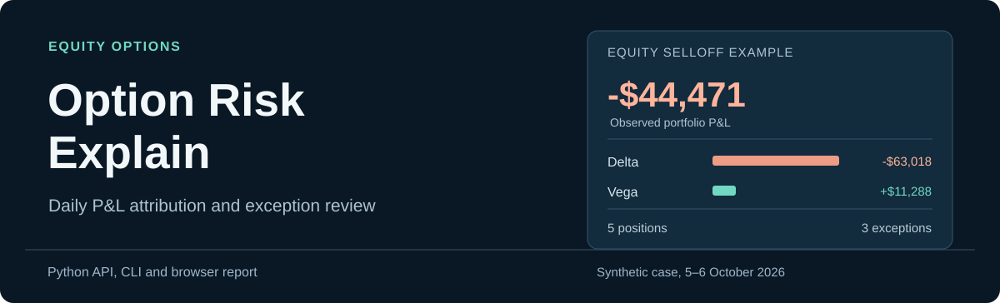
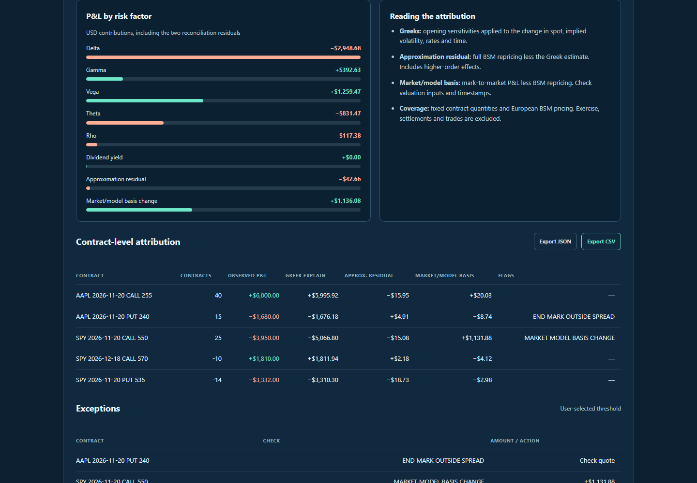

<p align="center">
  
</p>

**Daily P&L attribution for equity-option portfolios.** The package uses opening Greeks and full Black–Scholes–Merton (BSM) repricing to account for changes in option marks. It reports the remaining model approximation and market-basis effects by contract.

<p align="center">
  
</p>

## Example portfolio

The included portfolio has five synthetic SPY and AAPL option positions. Each scenario uses the same opening book and a different set of end-of-day prices and implied volatilities.

| Scenario | Portfolio P&L | Exceptions |
| --- | ---: | ---: |
| Daily desk review | -$1,152 | 2 |
| Equity market selloff | -$44,471 | 3 |
| Volatility repricing | +$13,735 | 0 |
| Valuation exception | +$1,146 | 3 |

In the selloff case, the opening Delta estimate contributes **-$63,018** and Vega contributes **+$11,288**. Full BSM repricing also captures the effects that a second-order Greek approximation misses. All four cases reconcile to the submitted mark-to-market P&L.

The browser loads the first report automatically. Selecting another case updates the portfolio summary, factor contributions, contract table and exception list. The scenarios use simulated data generated by `scripts/generate_scenarios.py`.

## Local setup

Requires Python 3.10 or later. The pricing and attribution code has no third-party runtime dependencies.

```bash
git clone https://github.com/garroshub/Option-Trading-Analytical-Platform-App.git
cd Option-Trading-Analytical-Platform-App
python -m pip install -e .
python -m option_lab serve
```

Open **http://127.0.0.1:8765/**.

The `docs/` site also runs on static hosting with all four saved scenarios. Processing an uploaded CSV portfolio requires the local Python server. The upload controls are under **Custom portfolio analysis**.

## P&L calculation

| Component | Calculation |
| --- | --- |
| Observed P&L | Change in submitted option marks × signed contracts × multiplier |
| Greek attribution | Opening Delta, Gamma, Vega, Theta and Rho applied to market changes, plus dividend-yield repricing |
| Approximation residual | Full BSM repricing less Greek attribution |
| Market/model basis | Observed P&L less full BSM repricing |
| Exceptions | Residuals above a selected USD threshold, crossed quotes and marks outside the supplied bid/ask |

The reconciliation is:

```text
Observed P&L
  = Greek attribution
  + Approximation residual
  + Market/model basis
```

Vega and Rho use one-percentage-point changes. Theta uses calendar days. The dividend effect changes the yield while keeping the other opening inputs fixed.

## Python API

```python
from pathlib import Path
from option_lab import explain_csv

report = explain_csv(
    Path("examples/positions_2026-10-05.csv").read_text(),
    Path("examples/positions_2026-10-06.csv").read_text(),
    exception_threshold=500,
)

print(report["totals"]["observed_pnl"])
print(report["totals"]["reconciliation_error"])
print(report["exceptions"])
```

`explain_portfolio(start_rows, end_rows)` accepts two lists of position dictionaries.

The CLI writes a full JSON report and contract-level CSV:

```bash
python -m option_lab explain --start examples/positions_2026-10-05.csv --end examples/positions_2026-10-06.csv --threshold 500 --output examples/report.json --csv-output examples/report-positions.csv
```

The local HTTP endpoint is `POST /api/explain` with JSON fields `start_csv`, `end_csv` and `threshold`.

## Input files

Each snapshot has one row per option contract. Contract identities, signed quantities and multipliers must match on both dates.

| Required CSV fields | Interpretation |
| --- | --- |
| `as_of`, `expiry` | ISO dates, YYYY-MM-DD |
| `underlying`, `option_type`, `strike` | Option contract identity |
| `quantity`, `multiplier` | Signed contract count and shares per contract |
| `spot`, `mark` | Underlying price and option mark per share |
| `volatility`, `rate`, `dividend_yield` | Annualized decimal inputs, e.g. `0.25` for 25% volatility |

Optional fields: `bid`, `ask` and `source`.

The [opening snapshot](examples/positions_2026-10-05.csv) and [closing snapshot](examples/positions_2026-10-06.csv) reproduce the desk-review case. Other cases and their inputs are stored in [risk-scenarios.json](docs/risk-scenarios.json).

## Additional tools

The package retains the original European option pricer and Greeks. The local server can also display Yahoo Finance quotes and option chains using an optional dependency:

```bash
python -m pip install -e ".[market]"
python -m option_lab quote SPY
python -m option_lab expirations SPY
python -m option_lab price --spot 100 --strike 100 --days 365 --rate 5 --volatility 20
```

The original Streamlit files remain in the repository.

## Validation and scope

The attribution applies to **unchanged USD option positions** and uses a **European BSM model** with continuous dividends and ACT/365 maturity. Exercise, trades, settlement, fees, FX and corporate actions are outside the calculation. Model and market marks may differ because of inputs, valuation conventions or timestamps.

Exception thresholds are user-defined. Institutional deployment would require independent market-data controls, validated pricing conventions and risk governance. This implementation does not perform the regulatory FRTB P&L attribution test.

```bash
python -m scripts.make_risk_fixtures
python -m scripts.generate_scenarios
python -m unittest discover -s tests -p "test_*.py" -v
node --test tests/pricing.test.mjs
python -m build --wheel --no-isolation
python tests/wheel_smoke.py
```

The tests check BSM reference values, portfolio reconciliation, invalid snapshots, all four precomputed scenarios and Chrome browser workflows. The installable distribution is `garros-option-lab` and the Python module is `option_lab`.
